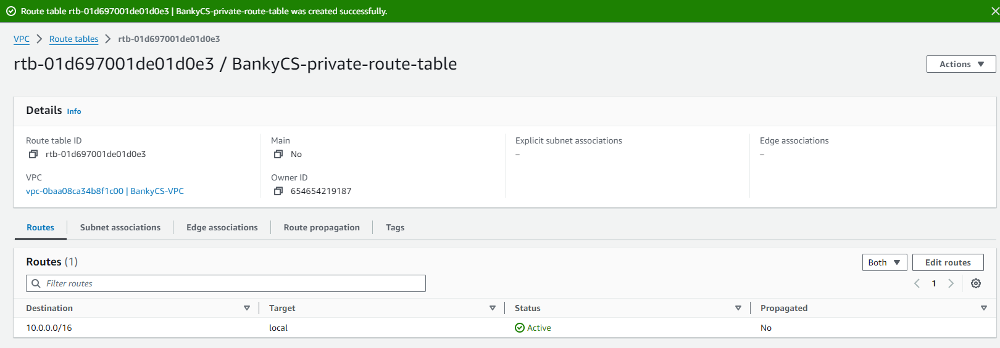
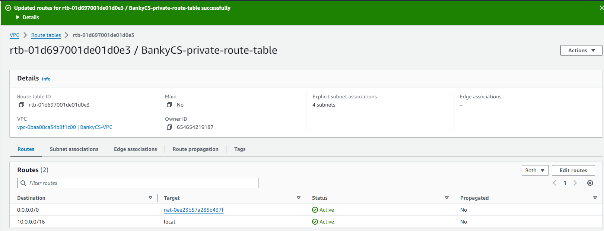
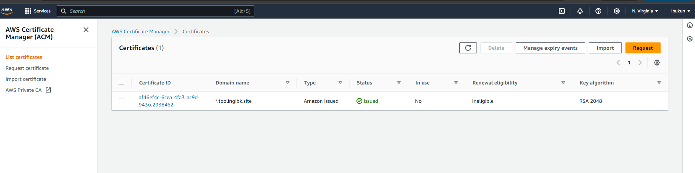

## **Documentation for Project 15**

### AWS Cloud Solution For 2 Company Websites Using A Reverse Proxy Technology

### Creating a VPC

### Enabling DNS Hostnames

### Creating Internet Gateway

### Attaching our Internet Gateway to our VPC

### Creating Route Table for our Public Subnet

### Creating Route Table for our Private Subnet

### Associating our Public Subnets with our Public Route Table

### Associating our Private Subnets with our Private Route Table

### Editing the route for our Public Route Table

### Creating a NAT Gateway to associate with Private Route Table

### Allocating an Elastic IP for our NAT Gateway

### NAT Gateway created for our private route table

### Editing the route for our Private Route Table and associating our NAT Gateway with our Private route Table

### Creating Security Groups for our External ALB and our resources

### Creating Security Group for our Bastion host to allow ssh access only from our computer IP not from anywhere

### Creating Security Group for our Reverse Proxy Server (Nginx) to allow HTTP and HTTPS traffic from our external ALB and ssh access from our Bastion Server

### Creating Security Group for our Internal ALB to allow HTTP and HTTPS traffic from Nginx Reverse Proxy

### Creating Security Group for our Web servers to allow HTTP and HTTPS Traffic from our Internal Load Balancer and ssh access from Bastion Host

### Creating Security Group for Datalayer access to NFS Database and Bastion

### Creating a certificate in order to create an application Load Balancer

### Certificate issued after creating record in route 53

### Creating EFS for Private Subnet 1 and 2 so that our webservers in that subnet will be able to mount on that storage

### Creating access points that our webservers will use to mount, one for wordpress Webserver and another one for Tooling Webserver

### Creating RDS, which involves creating a KMS key in a KMS Store and creating a Subnet Group

### Creating a KMS Key to encrypt the Database Instance

### Creating a Subnet Group for our RDS Which Resides in Subnet 3 and 4

### Creating a Database (RDS)

### Setting up our compute resources for Bastion, Webservers and Nginx

### AMI's Created for our 3 Resources

## Setting up our Bastion
### Installing epel-release and remi-repo

### Installing tools needed for our Bastion to run

### chrony started and running
`sudo systemctl start chronyd`
`sudo systemctl enable chronyd`

### Installing tools needed for our Bastion to run

## Setting up our Nginx
### Installing epel-release and remi-repo for Nginx

### Installing epel-release and remi-repo for Nginx

### chrony started and running
`sudo systemctl start chronyd`
`sudo systemctl enable chronyd`

### Installing all necessary tools on Nginx

### Configuring SE Linux Policies for Nginx

### Installing Amazon EFS Utility for Mounting our Target on the Elastic File System

### Setting up Self Signed Certificate for our Nginx Instance

## Setting up our Webserver

### Installing epel-release and remi-repo on Our Webserver

### Installing all necessary tools on Webserver

### chrony started and running
`sudo systemctl start chronyd`
`sudo systemctl enable chronyd`

### Configuring SE Linux Policies for Webserver

### Installing Amazon EFS Utility for Mounting our Target on the Elastic File System

### Setting up Self Signed Certificate for our Apache webserver Instance

### Using Openssl command to generate our key and certificate

### Specifying path to our generated key and cert in ssl.conf config file

### Specifying path to our generated key and cert in ssl.conf config file, changing it from default to our generated key and cert name

### Creating an AMI for each of our instances

## Creating target Groups for applications behind our Load Balancers

### Creating a target group for our required resources, nginx, tooling and wordpress servers

